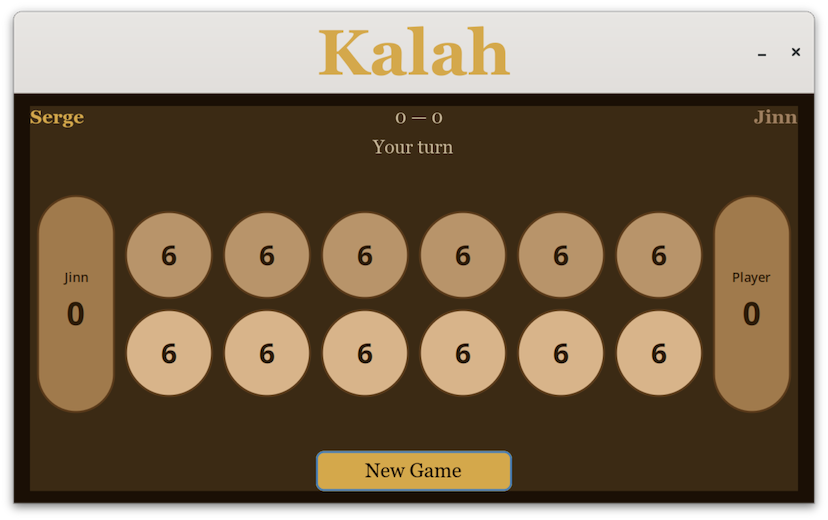

# Kalah

Kalah is an ancient two-player strategy board game from the Mancala family. You play against a computer opponent (the Jinn) who uses a minimax algorithm to choose its moves.



## How to Play

The board has two rows of six pits and a large scoring pit (kalah) on each end. Each pit starts with six stones.

On your turn, pick one of your six pits. All the stones in that pit are picked up and dropped one by one into the pits going counter-clockwise around the board. Three special rules apply:

- **Extra turn** — if your last stone lands in your own kalah, you go again.
- **Capture** — if your last stone lands in an empty pit on your side, and the opposite pit has stones, you capture all of them into your kalah.
- **Skip** — your opponent's kalah is always skipped when sowing.

The game ends when one player's six pits are all empty. The other player sweeps their remaining stones into their own kalah. Whoever has more stones in their kalah wins.

## Setup Screens

When you launch the game you will be walked through four short screens:

1. **Welcome** — click anywhere to begin.
2. **Name** — enter the name you want to play under.
3. **Gender** — used for in-game commentary.
4. **Difficulty** — choose how strong the Jinn plays:

| Level | Russian name | Description |
| ----- | ------------ | ----------- |
| Novice | Юноша | Easy — great for beginners |
| Candidate | Кандидат | Medium — a fair challenge |
| Participant | Участник | Hard — for experienced players |
| Master | Эфенди | Expert — maximum difficulty |

After setup the game starts immediately. Click **New Game** at any time to play again without repeating the setup.

## Building from Source

### Ubuntu / Debian

```bash
sudo apt install libgtkmm-4.0-dev cmake pkg-config
```

### macOS (Homebrew)

```bash
brew install gtkmm4 cmake pkgconf
```

### Build

```bash
git clone <repo-url>
cd kalah-ui
make
build/bin/kalah
```

Other make targets:

```bash
make debug    # build with debug symbols
make test     # build and run unit and integration tests
make clean    # remove build directory
```

## Implementation Details

For a full description of the game engine, AI algorithm, class design, and rule implementation see [src/Kalah.md](src/Kalah.md).

## License

See [LICENSE](LICENSE) if present, otherwise all rights reserved.
